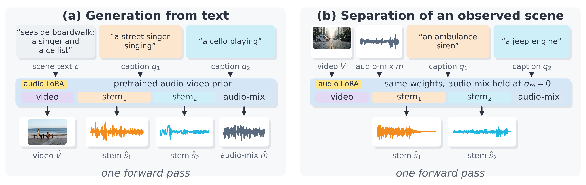

<h2 align="center">SepGen: Multi-Stem Audio-Video Separation and Generation in a Single Model</h2>

<p align="center">
  <b>Aviad Dahan</b><sup>1*</sup>, <b>Rajaei Khatib</b><sup>1*</sup>, <b>Yonatan Bitton</b><sup>2</sup>,
  <b>Idan Szpektor</b><sup>2</sup>, <b>Lior Wolf</b><sup>1</sup>, <b>Raja Giryes</b><sup>1</sup><br>
  <sup>1</sup>Tel Aviv University &nbsp; <sup>2</sup>Google &nbsp; <sup>*</sup>Equal contribution
</p>

<p align="center">
  <!-- ARXIV: replace with <a href="https://arxiv.org/abs/ID"></a> -->
  
  <a href="https://sepgen.github.io/"></a>
  <a href="https://huggingface.co/collections/AviadDahan/sepgen-6ac3e516dd6528007ad32352"></a>
  <a href="https://huggingface.co/datasets/AviadDahan/SepGen-Dataset"></a>
</p>

Video generators such as LTX-2 make a video together with one soundtrack, with every sound mixed
into it. **SepGen** also gives you each sound on its own audio track (a *stem*), and it works in
both directions with the same model:

- **Generate:** describe a scene and each sound in it. You get the video, the full soundtrack and
  one track per sound.
- **Separate:** give it an existing video and describe each sound you want. You get one track per
  description.



**Contents:** [Quick start](#quick-start) · [Separate a video](#separate-a-video) ·
[Generate from text](#generate-from-text) · [Moving-camera demo](#moving-camera-demo) ·
[Training](#training) · [Checkpoints](#checkpoints) · [Release status](#release-status) ·
[Citation](#citation) · [License](#license)

## Quick start

You need Linux, `ffmpeg`, and one NVIDIA GPU with 48 GB of memory. Every result in the paper ran on
a single RTX A6000.

**1. Install.** This clones LTX-2 (the LTX-2.5 release SepGen builds on) and creates its Python
environment.

```bash
git clone https://github.com/AviadDahan/SepGen && cd SepGen
bash setup.sh
source activate.sh
```

**2. Download the weights.** First accept the license on the
[LTX-2.5 model page](https://huggingface.co/Lightricks/LTX-2.5), then:

```bash
hf auth login
bash download_weights.sh   # about 72 GB into ./models/ltx2.5
```

To keep the weights somewhere else, set `SEPGEN_MODELS=/path/to/ltx2.5` before both commands.

**3. Try it** on the included example (a blacksmith and a church bell):

```bash
python separate.py --batch-manifest examples/separation_manifest.json --out-dir outputs/separation
python generate.py examples/generation_prompts.json --cells turn_taking_1 --out-dir outputs/generation
```

Each clip takes several minutes on one A6000. Results land in `outputs/`.

## Separate a video

Give SepGen a video and three descriptions: the whole scene and each of the two sounds.

```bash
python separate.py --video my_clip.mp4 \
    --scene-prompt "A blacksmith hammers on an anvil while a church bell rings." \
    --stem0-prompt "A blacksmith hammers rhythmically on an anvil." \
    --stem1-prompt "A church bell rings steadily." \
    --num-frames 113 --frame-rate 25 --out-dir outputs/my_clip
```

You get `stem_0.wav` and `stem_1.wav`, one per description.

Tips:
- Set `--frame-rate` to your clip's frame rate. `--num-frames` must be of the form 8k+1, e.g. 113
  frames at 25 fps or 137 frames at 24 fps.
- For long clips (above about 185 frames) add `--vae-tiling`.
- To run many clips with one model load, list them in a JSON file and pass `--batch-manifest`; see
  [examples/separation_manifest.json](examples/separation_manifest.json).
- `--checkpoint gen-3k` uses the generation checkpoint instead; it separates about as well.

## Generate from text

Write a JSON list of scenes, each with a seed, a scene description and one description per sound:

```json
[{"segment": "my_scene", "seed": 7,
  "scene_prompt": "A street singer and a cellist perform on a seaside boardwalk.",
  "stem_prompts": ["A street singer, singing.", "A cello playing."]}]
```

```bash
python generate.py my_scenes.json --out-dir outputs/my_scenes
```

Each scene gives you:
- `video.mp4`: the video with its full soundtrack;
- `stem0.wav` and `stem1.wav`: one track per sound, plus `mix_generated.wav`;
- one video per track, and `sources_split_ears.mp4` with one sound in each ear.

[examples/generation_prompts.json](examples/generation_prompts.json) holds the scenes from the
project page with the seeds used in the paper. Add `--stock` to render the same prompts with plain
LTX-2.5 for comparison.

<details>
<summary>Settings used in the paper</summary>

- **Separation** (`separate.py` defaults): 30 Euler steps at 768×512, Cross-Stem Attention Guidance
  scale 2.0, base model quantized to int8 as in training.
- **Generation** (`configs/generation.json`): two stages to 1536×1024, 113 frames at 25 fps,
  res_2s sampler with 15 steps, the LTX-2.5 distilled LoRA at strengths 0.25 and 0.5 as in the
  upstream two-stage pipeline, Estimated Separation below σ = 0.97, checkpoint `gen-3k`.

</details>

## Moving-camera demo

The project page shows clips re-rendered from a new camera, with each separated sound placed where
its source is. [`demo/`](demo/README.md) reproduces them:

1. SepGen separates the sounds and finds where each one is in the frame.
2. LTX-2.3 with the CrossView-Warp IC-LoRA re-renders the clip from a moving camera, guided by
   MoGe-2 depth.
3. Each sound is re-rendered as stereo for the new camera position.

```bash
bash demo/setup_demo.sh && bash demo/download_demo_weights.sh
bash demo/run_demo.sh <clip.mp4> <mix.wav|-> <scene> <stem0> <stem1> <seed> <out_dir>
```

The demo needs extra environments and weights; [demo/README.md](demo/README.md) covers them.

## Training

```bash
python train.py configs/train_sep12k.yaml --data-root /path/to/precomputed_train
python train.py configs/train_gen3k.yaml --data-root /path/to/precomputed_train \
    --init-checkpoint sep-12k --stop-at-step 3000
```

- `sep-12k` trains for about 42 hours and `gen-3k` for about 11 more, on one RTX A6000.
- The base model stays frozen; only a LoRA on its audio stream is trained.
- The training manifests (captions, source boxes and where each clip comes from) are on
  [Hugging Face](https://huggingface.co/datasets/AviadDahan/SepGen-Dataset). The precomputed
  latents and text features will be released soon; [docs/DATA.md](docs/DATA.md) describes their
  format.

<details>
<summary>Training details</summary>

- Batch size 1, AdamW at 1e-4 with linear decay, base model in int8.
- The paper's `sep-12k` run was resumed once, at step 2000, with the optimizer state reset.
- `gen-3k` starts from `sep-12k` with a fresh optimizer. Its learning-rate schedule spans 12,000
  steps, and training stops at step 3000.

</details>

## Checkpoints

| Name | Download | Trained for | Use it for |
|---|---|---|---|
| `sep-12k` | [SepGen-Separation](https://huggingface.co/AviadDahan/SepGen-Separation) | 12,000 steps of separation | separation |
| `gen-3k` | [SepGen-Generation](https://huggingface.co/AviadDahan/SepGen-Generation) | `sep-12k` + 3,000 steps with generation | generation and separation |

Both are LoRA adapters (327M parameters) for LTX-2.5 22B dev. Pass the name to `--checkpoint`
and it downloads on first use; a path to a local file also works.

## Release status

- [x] Separation and generation code
- [x] Training code and configs for both checkpoints
- [x] Checkpoints on Hugging Face
- [x] Moving-camera demo (`demo/`)
- [x] Training manifests ([SepGen-Dataset](https://huggingface.co/datasets/AviadDahan/SepGen-Dataset))
- [ ] Precomputed training latents and text features
- [ ] Evaluation benchmarks and scoring scripts

<details>
<summary>Repository layout</summary>

| Path | What it holds |
|---|---|
| `separate.py` | separation: video + descriptions → one track per sound |
| `generate.py` | generation: descriptions → video + soundtrack + one track per sound |
| `train.py` | training on the LTX trainer |
| `configs/` | the training configs of both checkpoints and the generation config |
| `sepgen/stemgen/` | training strategy, separation sampler and attention gates |
| `sepgen/stempipe/` | generation pipeline on top of the upstream two-stage LTX-2.5 pipeline |
| `sepgen/nag_attn2.py` | Cross-Stem Attention Guidance |
| `sepgen/localize/` | attention capture and the localization readout used by the demo |
| `demo/` | the moving-camera demo |
| `examples/` | example inputs |

</details>

## Citation

```bibtex
@article{dahan2026sepgen,
  title   = {SepGen: Multi-Stem Audio-Video Separation and Generation in a Single Model},
  author  = {Dahan, Aviad and Khatib, Rajaei and Bitton, Yonatan and Szpektor, Idan and Wolf, Lior and Giryes, Raja},
  journal = {arXiv preprint ARXIV_ID},
  year    = {2026}
}
```

## License

SepGen builds on LTX-2.5, so the code and the released weights are distributed under the
[LTX-2.x Community License Agreement](LICENSE.md), including its use restrictions (Attachment A).

<details>
<summary>Third-party components</summary>

- `sepgen/stemgen/ltx25_validation_sampler.py` is modified from the LTX-2 trainer.
- The demo also uses:
  - LTX-2.3, under the LTX-2 Community License;
  - the CrossView-Warp v2 IC-LoRA by Cseti (Cseti/LTX2.3-22B_IC-LoRA-CrossView-Warp_v2,
    Apache-2.0); its training renders used CC-BY assets credited in that repository's
    ATTRIBUTION.md;
  - `demo/crossview_warp.py`, ported from ComfyUI-CrossViewWarp
    (github.com/cseti007/ComfyUI-CrossViewWarp, commit 3266a83, Apache-2.0);
  - MoGe-2 (microsoft/MoGe code and Ruicheng/moge-2-vitl-normal weights, MIT);
  - Gemma-3, under the Gemma terms of use.

</details>
